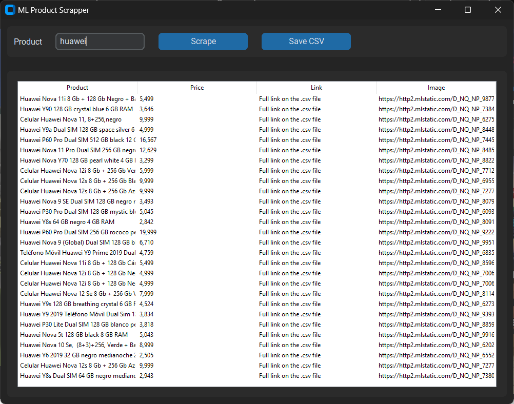

# ML Scraper 🐤

Este proyecto es un web scraper que extrae información sobre productos de Mercado Libre.

## Conocimientos

 - [BeautifulSoup](https://www.crummy.com/software/BeautifulSoup/bs4/doc/)
 - [CustomTkinter](https://github.com/TomSchimansky/CustomTkinter)

## Tecnologías

## Capturas

## Feedback

Si tienes alguna recomendación, duda, aclaración no dudes en contactarme: marmolejx@gmail.com

